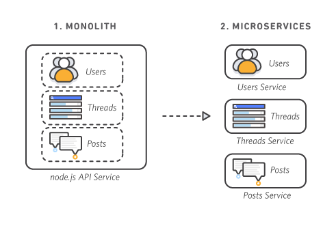
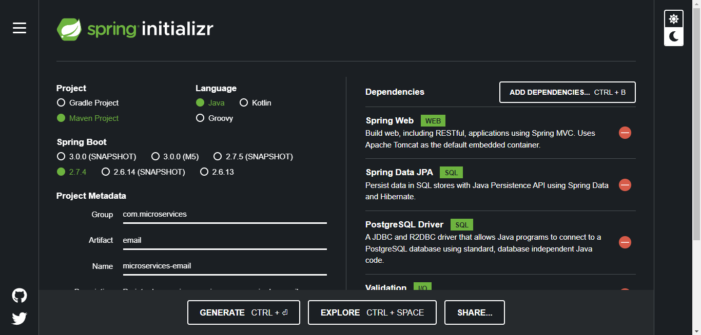
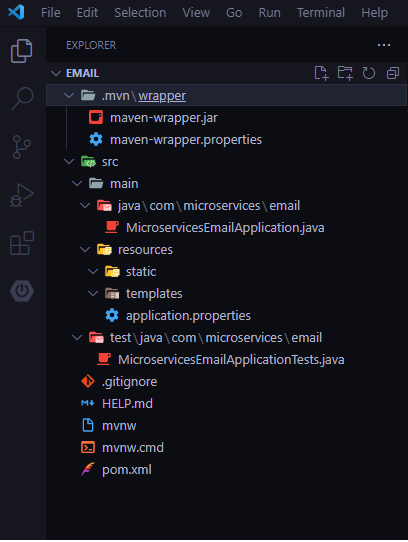
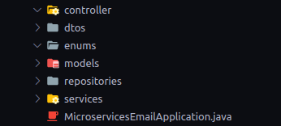
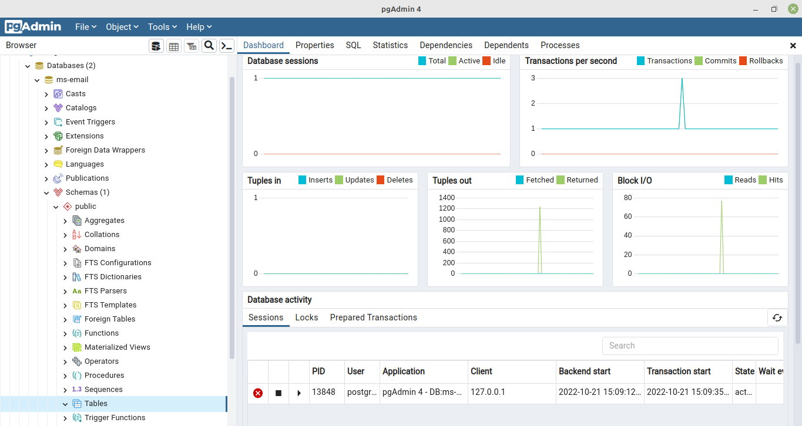

# Microsserviços - Envio de e-mails

<div align='justify'>
  <p>Microsserviços são arquiteturas de desenvolvimento de software capazes de reduzir grandes sistemas em pequenos serviços de forma a comunicarem através de APIs bem definidas. A vantagem é que esses serviços pertencem a pequenas equipes que em sua maioria são autossuficientes. Esse tipo de arquitetura facilita a escalabilidade e agiliza o desenvolvimento de aplicativos, acelerando o tempo de introdução de novos recursos no mercado.</p>

  <p>Portanto, a utilização de arquiteturas moníticas podem ser evitadas já que estas apresentam dificuldades como alto nível de acoplamento e uma escalada alta caso haja um grande pico de demanda. A complexidade de um sistema monolítco aumenta a cada adaptação de código, seja por aumento ou aprimoramento e isso ocasiona o risco da não disponibilidade de aplicações visto que o alto índice de acoplamento pode gerar falhas em um único processo.</p>
  
  <p>Nos microsserviços, um aplicativo é criado como componentes independentes. Esses executam cada processo como serviço e por fim se comunicam por meio de uma interface usando APIs. </p>

</div>

<div align = 'center'>
  
</div>

<div align='justify'>
  <p>Com a finalidade de criar uma aplicação autônoma e comunicativa, que possa ser utilizada por toda a arquitetura, propomos a criação de um microsserivço de e-mail.</p>
</div>

----
### O que será necessário?
----
 - O serviço de e-mail terá sua própria base dados, nesse roteiro iremos utilizar o PostgreSQL;
 - Linguagem Java, nesse roteiro será a versão 11;
 - Maven Project, Spring Web, Spring Boot, na versão 2.7.4, e o Spring Mail;
 - Spring initializer;
 - IDE da sua escolha, nesse roteiro será utilizado o VSCode.
 
----
## Criação
----

<div align='justify'>
  <p>Para a criação do sistema inicial, poderá ser utilizado o site <a href = 'https://start.spring.io/'>Spring Initializr</a> selecionando o projeto como Maven, a versão do java e do spring boot além do nome do projeto. A parte mais importante das escolhas fica nas dependências, e para esse serviço escolhemos as seguintes</p>
  
  <ol>
    <li>Web
    <ol>
        <li>Spring Web: É necessário para receber o e-mail com todos os dados para assim encaminhar para o usuário final.</li>
    </ol>
    <li>SQL
    <ol>
        <li>Spring Data JPA: Para a persistência de dados; </li>
        <li>PostgreSQL Driver: Para conectar ao banco utilizado nesse roteiro. </li>
    </ol>
    <li>I/O (Entrada e saída)
    <ol>
        <li>Validation: Realiza a validação do processo;</li>
        <li>Java Mail Sender: Realiza o processo de envio do e-mail.</li>
    </ol>
    <li>Ferramentas de desenvolvimento
    <ol>
        <li>Lombok: Auxilia na remoção de partes de código repetidas.</li>
    </ol>
    </li>
</ol> 

  <div align = 'center'>
    
  </div>

  <p>A partir da configurações realizadas acima, que podem ser obtidas no seguinte link <a href="https://start.spring.io/#!type=maven-project&language=java&platformVersion=2.7.4&packaging=jar&jvmVersion=11&groupId=com.microservices&artifactId=email&name=microservices-email&description=Projeto%20de%20um%20microsservi%C3%A7o%20para%20o%20envio%20de%20e-mails%20para%20a%20disciplina%20de%20Engenharia%20de%20Software&packageName=com.microservices.email&dependencies=web,data-jpa,postgresql,validation,mail,lombok">Configurações</a>, seguimos para a utilização de uma IDE que terá a uma estrutura de pastas como mostrado a seguir.</p>
  
  <div align = 'center'>
    
  </div>

----
## Setup inicial e inicialização do banco de dados
----

A fim de separar todo o processo em várias etapas, propomos a construção de algumas pastas para separação de arquivos, são elas:

<div align='center'>
  
</div>

Na pasta resources há um arquivo chamado application.properties, esse serve para estabelecer a conexão com o banco de dados, no entanto, ainda está vazio. Como estamos utilizando o PostgreSQL, o código abaixo, com a porta 5432 estabelecerá a conexão:

```
server.port = 8080

spring.datasource.url = jdbc:postgresql://localhost:5432/ms-email
spring.datasource.username = postgres
spring.datasource.password = banco123
spring.jpa.hibernate.ddl-auto = update
```

Lembrando que 5432 é a porta padrão, caso tenha alterado, use a sua e o ms-email é o nome do banco criado no PostgreSQL.

<div align='center'>
  
</div>

---
## Configurando o model para recebimento de e-mails
---

Com o banco de dados inicializado, devemos estabelecer as partes do nosso microsserviço e suas responsabilidades, começando pela pasta model, devemos criar um sistema de recebimento de armazenamento das informações do e-mail, destinatário e remetente, a data, o conteúdo e tudo que compõe o processo de comunicação, dito isso, em model, cria-se:

```
package com.microservices.email.models;

import java.time.LocalDateTime;

import javax.persistence.Column;
import javax.persistence.Entity;
import javax.persistence.GeneratedValue;
import javax.persistence.GenerationType;
import javax.persistence.Id;
import javax.persistence.Table;

import com.microservices.email.enums.StatusEmail;

import lombok.Data;

@Data // Criação de construtores automatizada
@Entity // É uma entidade por compor uma banco de dados
@Table(name = "TB_EMAIL") // Nome da tabela
public class MEmail {

    @Id
    @GeneratedValue(strategy = GenerationType.AUTO)
    // Geração de e-mails automatica
    private long emailId;
    private String ownerRef; // O proprietário da mensagem
    private String emailFrom; // De quem vem
    private String emailTo; // Para quem envia
    private String subject; // Assunto
    @Column(columnDefinition = "TEXT") // Retira a limitação de 256 caracteres
    private String text;
    private LocalDateTime sendDateEmail;
    private StatusEmail statusEmail;
}
```

Como o estado do e-mail não é uma classe própria do Java, devemos criar. Estabeleceremos que ela contenha os possíveis estados de um e-mail, portanto, enviado ou não enviado (error). Passível de enumeração, vamos criar StatusEmail.java na pasta enum com o seguinte código:

```
package com.microservices.email.enums;

public enum StatusEmail {

    SENT,
    ERROR;
}

```

---
## Configurando o dtos
---
Utilizado para transportar dados entre diferentes componentes de um sistema, o dto é utilizado em sistemas distribuídos e sistemas via serialização. A ideia é otimizar a comunicação por meio de um agrupamento de atributos, nesse caso 


</div>


